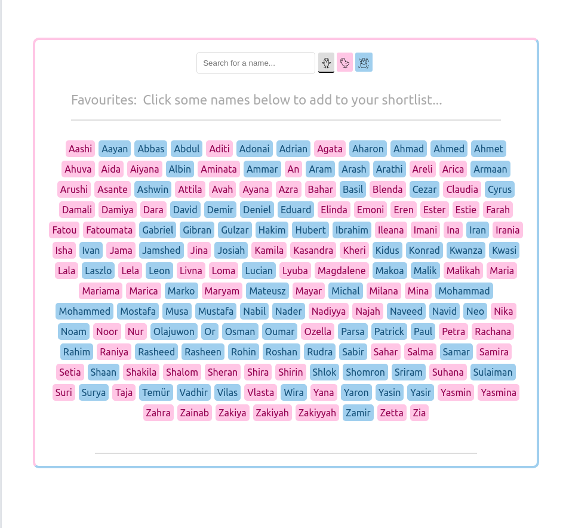
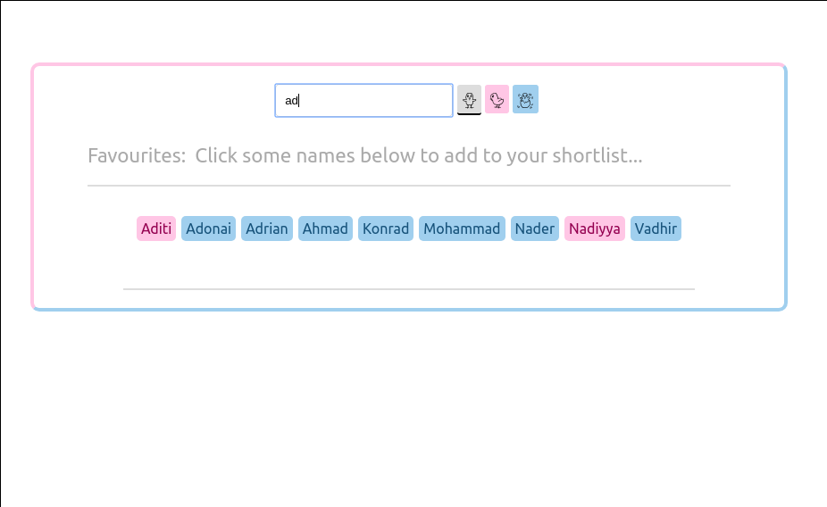
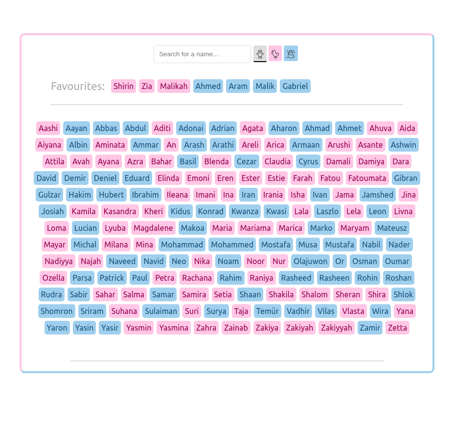

# Challenge: "Baby Name Picker (React)"

## Challenge Overview

Make a React app which shows some baby names and lets you pick your favourites. The names data is provided for you.

## Difficulty Level

This is a beginner challenge, suitable from students who have completed at least week 2 of the CYF React module.

(Level one can be completed by any student who has started the React module.)

## Pre-requisites - what do I need to know to finish this challenge?

- React `props`
- The `array.map` method as used in React JSX
- Event handlers: onClick for buttons
- Event handlers: onChange for input fields
- The `useState` hook

## Getting Started

Don't clone this repo.

Make your own React app using create-react-app.

### The data:

The data is available in the file [./babyNamesData.json](./babyNamesData.json).

Copy across this file to your src/ directory, and then import it.

## Hosting:

Add your project in github and host it on Netlify.

The github repo name should be exactly:
`baby-names-react`

The netlify site suffix should be `-baby-names`

so...

`cyf-YOURGITHUBUSERNAME-baby-names`

# Level 1 Challenge

Write a react app which lists baby names from the given file.

It should display boys' and girls' names differently.

The names should be displayed in alphabetical order, ascending.

Your project should be on GitHub and hosted with correct names (see Hosting, above).

### Example Screenshot

Note only the list of names is important here. The other elements in the screenshot can be ignored.

# Level 2 challenge

Add a search bar.

When someone types into it, your app should update the displayed list of baby names to only show matches.

Matches should be case-insensitive.

When the search bar is clear, all names should be shown.

### Example Screenshot

# Level 3 challenge

Add "favourites".

When the user clicks a name from the main list, it should be moved to a "favourites" list, displayed separately.

When the user clicks a name from the _favourites_ list, it should be moved back to the main list.

### Example Screenshot

# Level 4 challenge

Add "name gender" filter buttons.

Add buttons that allow the user to only see boy or girl names (or all names).

The buttons should operate as "radio" buttons - exactly one should be active at any time.

The app should start by showing all names.

The app should make it clear which filter is in effect.

_How it works with search:_

If there is also a search term in effect, your app should apply any name gender filter to those search results.

### Example Screenshot

# Beyond - ideas for more work

- Find a way to persist the favourites even after the browser tab is closed
- Add the ability for the user to shuffle the list of names
- Add the ability for the user to be presented with one or two randomly chosen names.
- Find an attractive way to differentiate names by gender that doesn't use blue/pink stereotypes.

## Further resources

# Credits

This application idea, and look, were taken from [Simon Vrachliotis'](https://simonswiss.com/) app, found via [react.rocks](https://react.rocks/example/Baby_name_inspiration).
