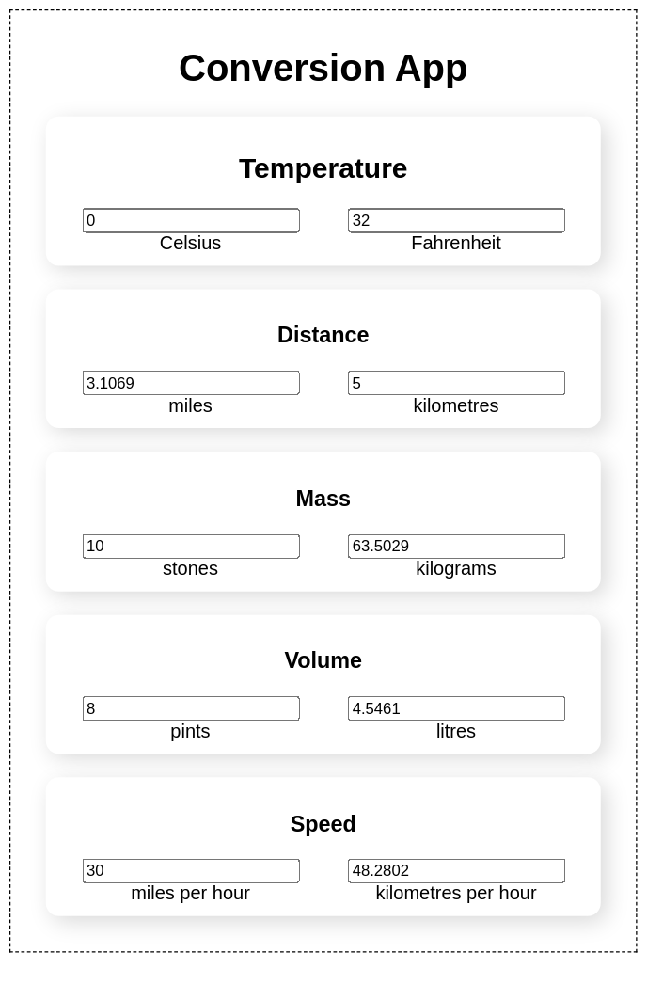

# Challenge: "Converters (React)"



Warning: This challenge is not yet ready for students to work on.
There are some unexpected complexities with the right way to do this in React.

## Challenge Overview

Make a React app which displays a set of converters to allow the user to carry out some common conversions (miles to kilometres, celsius to fahrenheit, and others).

## Difficulty Level

This is a beginner challenge.  Levels one to three can be completed by any student who has done at weeks 1 and 2 of the CYF React module.

## Pre-requisites - what do I need to know to finish this challenge?

- Event handling of changed input fields in React
- The `useState` hook
- React "controlled component" pattern


## A group project!

This is intended as a quick practice group project, to give you experience of multiple coders working at the same time on a single codebase.

Each student (or student pair) should be responsible for developing one converter at a time.

If you like you can consider using a trello board to break the work up.

## Estimated amount of work:

It should take approximately one to three hours, assuming all students have completed the challenge pre-requisites listed above.

# Level 1:

1. Add the following converters to your app:

* distance: between miles and kilometres
* temperature: between celsius and fahrenheit

You can find formulae for these conversions later in this document.

2. Ensure they give correct values for many situations: try to think of values that might cause your code to break.
2.1. List these test values and the corresponding expected outcomes.

Here are some example cases - they should each give the stated expected output:

| Input | Expected Output |
| ----- | --------------- |
| Enter a temperature of "-40" celsius | Result is -40 fahrenheit |
| Enter a temperature of "32" fahrenheit | Result is 0 celsius |
| Enter a temperature of "0" celsius | Result is 32 fahrenheit |

Think of more!

# Level 2 - some validation

If a conversion cannot be done on a changed input (perhaps because the user has emptied the input field or typed so far only "-"), the opposite side should be blank (or show placeholder text).  It should not show a number (perhaps from a previous calculation) as this could mislead the user into thinking this number is the successfully calculated value.
More test cases

| Input | Expected Output |
| ----- | --------------- |
| Enter any input as empty | Result is a blanking of the corresponding output field |
| Enter any input as just the negative sign "-" | Result is a blanking of the corresponding output field |
| Enter a distance of 010 kilometres | Result is 6.21371 miles (or 6.214) |
| Attempt to enter a temperature of "junk" | Either: user is not permitted to enter that, or the result is a blanking of the corresponding output field |

# Level 3 - Add more converters:

1. Add the following converters: 
* speed: mph-kmph
* mass: stone-kg
* volume: pint-litre

2. Consult the conversions formulae below

3. Ensure the *look* of each converter is consistent with the others and that the two rows of inputs are aligned.

4. Ensure the *behaviour* of each converter is consistent with the others (e.g. with edge cases such as when an input field is emptied.)

# Conversions:

Use the following formulae to calculate your conversions.

You will have to work out (or google) how to convert in the opposite direction.

```
distance: to convert m miles to km: multiply m by 1.60934
speed: to convert mph miles to kmph: multiply mph by 1.60934
temperature: to convert c celsius to fahrenheit:  multiply c by 1.8 then add 32
volume: to convert p pints to litres: multiply p by 0.568261
mass: to convert s stones to kilograms: multiply s by 6.35029
```

# Bonus:

#### Rounding: 

* Give the converted value to 4 significant figures

#### Unit testing:

"Extract" the core conversion functionality into "pure" functions and write unit tests for them that can be run automatically (e.g. with npm run test)
