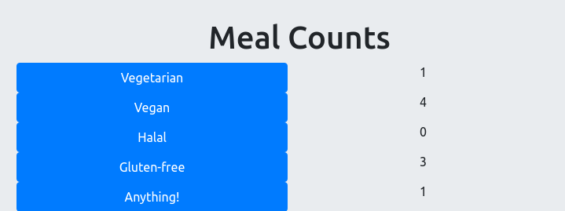
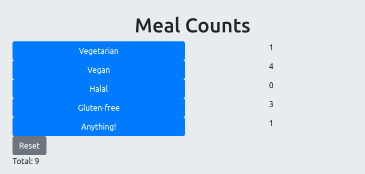

# Challenge: Lunch Order Counters

## Challenge Overview

Make a React app which assists you in taking an order for lunch for a large group.

It should provide multiple counters for different options (vegetarian, halal, vegan, etc).

### Try a live demo

[Try the live demo here](https://cyf-counters-react.netlify.com/).

### Example Screenshot

## What you need to know before starting:

This challenge is suitable if you have successfully completed the homework of CYF React Week 2.

# Try to figure the rest out by yourself

If you want a harder challenge, don't read the rest of this document but try to build the app by yourself.

# Suggested approach

Here's one approach you might take to building this app.

## Task: Create a new React app

Create a new empty React app for this challenge.

The tool can take a while to run, so continue with the next task while it's running...

## Task: Design your layout _on paper_

Design your layout on paper. Keep it very simple - this is a React challenge, not a CSS challenge.

Use a layout that will be ok on a phone (but don't do responsive design).

Keep this drawing around for reference later.

## Task: Convert your layout to JSX (HTML)

Make a prototype which just shows two or three example counters. _Don't_ worry about the JSON yet.

You can do this all within your `App.js`, or you can immediately build some React Component(s).

## Task: Make a component to represent a counter

Make a single counter which has a title given to it and which increments its count when clicked.

## Task: Use this component repeatedly

Reuse your component for each meal option you want to present.

## Task: Host your app

Host your app and prove it works by viewing it on your phone!

## Task: Host your app

Host your app and prove it works by viewing it on your phone!

We recommend you use Netlify. [Instructions are here](https://gist.github.com/nbogie/bf58a391fab6884f77a6adec66047181).

(You can instead use Heroku to host, or github pages, or codesandbox.io, or glitch.com...)

## Advanced challenges: total, and reset

See more detail below...

### Advanced Challenge: Add a reset button

Add a reset button which will set all counts back to zero.

### Advanced Challenge: Add a total

Add a live total of meals selected.
