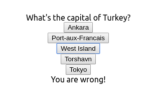

# Challenge: make a country-capital guessing game

## Example layout

Load the json, `capitals.json`

Make a react app which:

- randomly chooses a country from the list of capitals,
- presents 5 possible capitals to choose from (one being correct),
- tells you if you guess correctly or not.

# Additional challenges

- Add scoring or counting of your winning streak.

- Add a timer?

# Data source:

Combined and cleaned from http://country.io/data/
