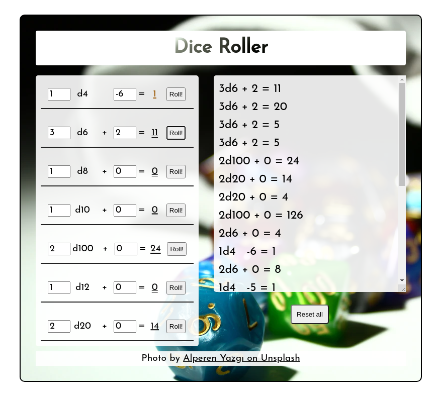
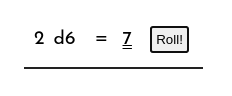
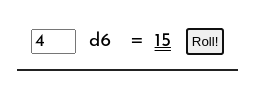
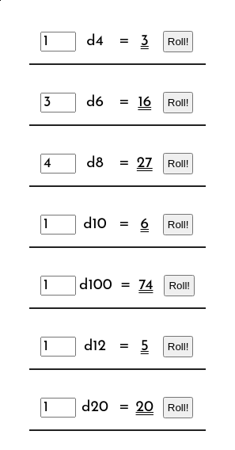
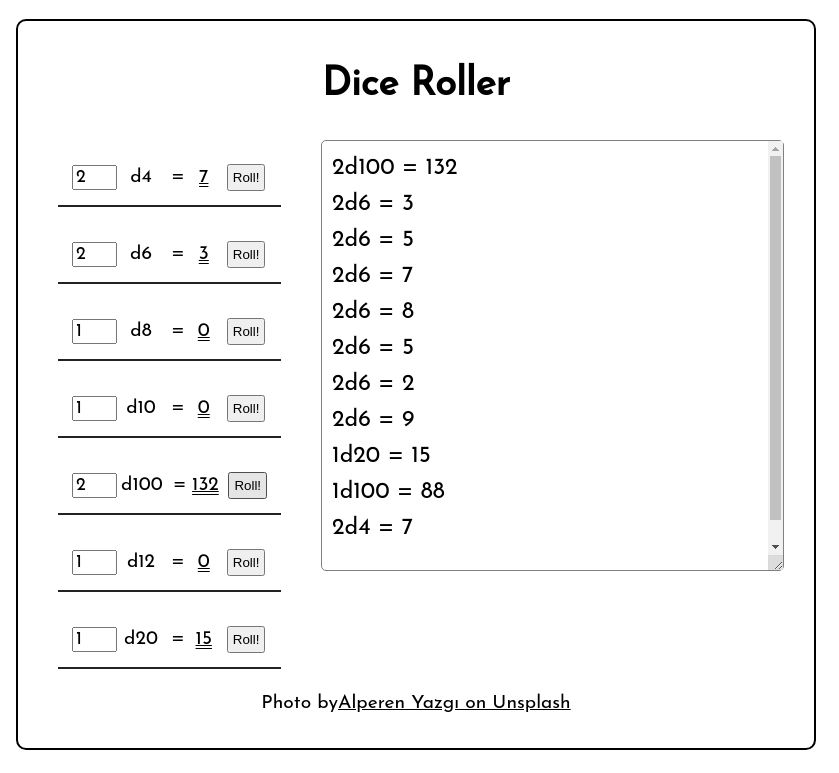
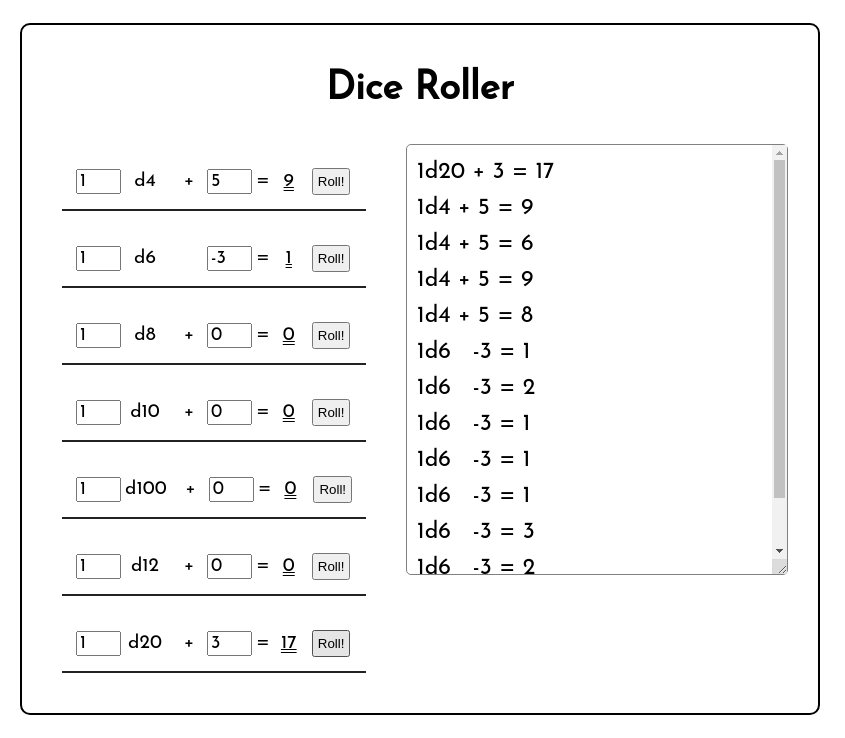
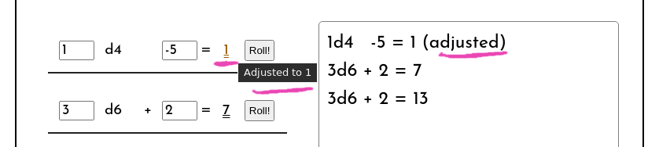

# Challenge: "Dice Roller (React)"

## Challenge Overview

Make a React app which generates random dice roll results for you, based on the number and type of dice.

For example, a request for "3d20" would "roll" three dice each with twenty faces, and return their total.

This challenge is for fans of games such as Dungeons and Dragons, where these dice combinations are used frequently. It's probably not very interesting if you've never played those games, however, here's [a short video introducing the various kinds of dice](https://www.youtube.com/watch?v=qQq_WsPFiDs&t=1m59s) in case you are curious.

## Difficulty Level

Suitable for those who have finished week 2 of the React module.

## Pre-requisites - what do I need to know to finish this challenge?

To complete levels 1 to 4, you will need knowledge of:

- React component creation
- Parameterising components with `props`
- Tracking state (e.g. with useState)
- Event handlers: for buttons and input text fields

## Getting Started

**Don't** clone this repo.

Make your own React app using `create-react-app`. See [(this guide)](https://docs.codeyourfuture.io/students/guides/creating-a-react-app) if you have forgotten how.

## GitHub & Hosting:

Add your project in github and host it on Netlify.

The github repo name should be exactly:
`dice-react`

The netlify site suffix should be `-dice`

so...

`cyf-YOURGITHUBUSERNAME-dice`

# Level 1 Challenge

- Write a react app which simulates the results of dice rolls of two six-sided dice.

- It should have a single component called `DieRoller` or similar. (A "die" is the english singular term for dice).

- It should have a "roll" button to generate a new result.

- The generated total of the two dice should be displayed each time.

- Your project should be on GitHub and Netlify with correct names (see Hosting, above).

Tip:

Try to keep everything to do with the dice roll neatly inside of a component (Why? Eventually you will need to make and configure many instances of this component).

### Example Screenshot

# Level 2 challenge

- Add a numeric input field to allow the user to control _how many_ dice are being rolled.

- Update your calculation to account for the correct number of dice.

### Example Screenshot

# Level 3 challenge

- Instead of always rolling a _six_-sided dice, have your component receive a prop, `numberOfFaces`, from its parent.

- Update your calculation to use the value of this prop. Example: if `numberOfFaces` is 20, and your user has chosen to roll 5 dice, you will generate the roll for 5 dice which each have 20 sides. (In this case the number will be between 5 and 100.)

- In the parent component, instantiate seven of your `DieRoller` components, each with a different number of faces, following this list:

  - 4, 6, 8, 10, 100, 12, 20

- Make it look however you want. There is no dictated layout or styling for this challenge.

### Example Screenshot

This is just an example.

You are encouraged to lay your app out creatively - it is a tool used in a game, after all!

# Level 4 challenge

- Add a single "log" textarea which will keep a history of your dice rolls.

- Each time a DieRoller makes a roll it should add a line to the _top_ of the log.

- This "log" textarea will be rendered by your parent component, **not** by any DieRoller.

### Example Screenshot

# Level 5 challenge

- Add a "modifier" to each DieRoller. This is a numeric input the user can change, which gets added to the total dice roll.

- Modifier can be positive or negative.

- The total result of any roll should never be less than 1. If the total of a roll once added to its modifier would be less than 1, the result should be 1.

### Example Screenshot

# Level 6 challenge

- If a DieRoller result has been adjusted to 1 from lower than 1, make the result look different so the user can see it has been adjusted.

- To do this, use a CSS class, and also suitable explanation in a title/tooltip hover.

### Example Screenshot

# Level 7 challenge

- Add error handling so that no change is made to the number of sides, or the modifier, if the user enters whitespace in that field.

- If a field is blank, non-numeric, or otherwise unsuitable, it should revert to a previous value.

- Ensure the user can enter all sensible values, _including_ setting the modifier _back_ to zero.

# You are finished!

Congratulations!

Now... are your sure your code is as readable as possible?

# Beyond - ideas for more work

- Easy: display an image in each DieRoller, showing the type of dice in use. [Example](https://www.wizards.com/dnd/dice/dice.htm)

- Intermediate: use a chart library to make a chart of the distribution of results of 1000 simulated rolls.

- Advanced: Add a reset button in the parent.

- Very advanced: Add some CSS (or 3d) animation of the dice. [3d example](http://a.teall.info/dice/).

- Very advanced: Allow free-text expressions to be written, such as `1d20 + 2d4 + 2`.

## Further resources

- [Dice notation](https://en.wikipedia.org/wiki/Dice_notation) - only for the curious. It won't help you in this challenge.
- [Dice 101 - an intro video about dice in the DnD game](https://www.youtube.com/watch?v=qQq_WsPFiDs&t=1m59s)

# Credits

Background image in some screenshots is by [Alperen Yazgı on Unsplash](https://unsplash.com/photos/QuP5RL_E5oE).
