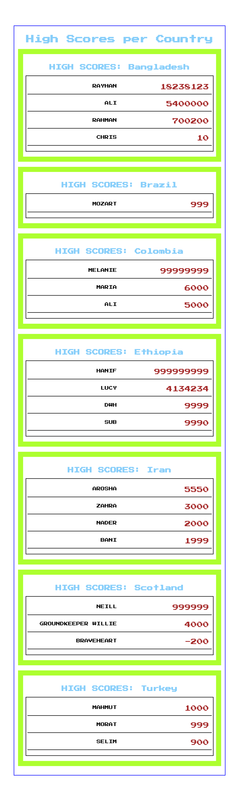

# Challenge: "High Score Tables (React)"

## Challenge Overview

Make a React app which lists some high score tables. The scores data is provided for you.

## Difficulty Level

This is a beginner challenge.  Level 1 can be completed by students who have completed week 1 of the CYF React module.

## Pre-reqs

- react `props`
- `array.map` method as used in React JSX

To finish level 4

- event handling (handle a button click)
- Keeping state with the state hook (`useState`)

### Example Screenshot

Level 1 challenge screenshot example.

# Level 1 Challenge

* Write a React app which displays high score tables for the given data.

* Each country must have its own High Score table displayed.

* Your app must be hosted on Netlify (see "Hosting" below).

* You must make AT LEAST:
  - `HighScoreTable` - a table with a country name and a list of player-scores for that country.
  - `PlayerScore` - component responsible for displaying a single score by one player (e.g. as one line of the table) (e.g. `Neill 2000`)

### Getting Started

**Don't** clone this repo.

Make your own React app using `create-react-app`.  See [(this guide)](https://docs.codeyourfuture.io/students/guides/creating-a-react-app) if you have forgotten how.

Copy across the score file (or the score file's contents) from this repo to your app, and then import from that file.

Write a plain HTML prototype first for two or three countries (e.g. on codepen).  THEN, once you know the HTML you're attempting to create, work on the React version!  This is not mandatory but it is recommended.

### The data:

The data is available in the file [./scores.js](./scores.js).   Here is [a raw version of it](https://raw.githubusercontent.com/codeyourfuture/cyf-react-challenges/master/challenge-high-score-tables/scores.js), suitable for saving.

You can copy this array of data into your App.js or you can import it.

## Hosting:

Add your project in github and host it on Netlify.

The github repo name should be:
`high-scores-react`

The netlify site suffix should be `-scores`

so...

`cyf-YOURGITHUBUSERNAME-scores`

# Level 2

- Present the High Score Tables sorted alphabetically by country name

# Level 3

- Within each individual table, show the highest scores first - i.e. sort the scores numerically, descending.

# Level 4 - advanced (needs content from React week 2)
- Add a _single_ button at the top of the page which toggles the sort order of every high-score-table between ascending and descending by scores.  This will require some study about event handlers and the use of a "State hook".

# Level 5 - advanced

- Add a "world-wide" table, shown first, which shows the sorted high scores from EVERYONE, regardless of country.

# Bonus
- Add your own country and scores!
- Add some old-skool videogame icons or animations
