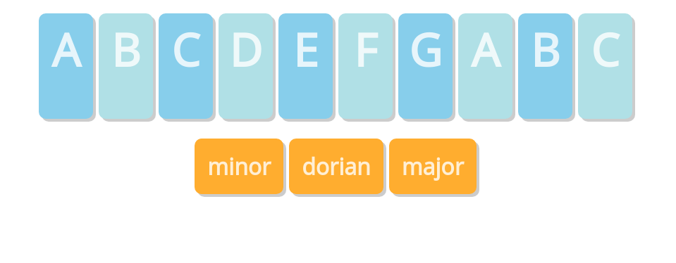

# Challenge: "Musical Keyboard" with React and Tone.js

## Challenge Overview

You must make a React app which presents a very simple musical keyboard made of buttons. When a button is pressed, the correct musical note sounds.

### Try a live demo:

[Try this live demo!](https://cyf-tones-react.netlify.com/)

### Example Screenshot

## What you need to know before starting:

This challenge is suitable if you have successfully completed the homework of CYF React Week 1.

You _will_ need to know...

- how to create a React app
- how to create a component in React
- how to pass props
- how to populate components from an array
- how to handle events (button clicks)

In addition, you'll learn...

- How to install a library (in this case, tone.js)
- How to make synthesised sound with the tone.js library. This is one of many ways to make sound in a web app.

# Task: Install the "tone.js" library

- If you haven't created your app yet, use `create-react-app` to create the skeleton of the app.
- Check the app works, by running `npm start` from your app's root directory.
- **Use the following command to install the tones library:
  `npm install tone`**
- Check the app STILL works, with `npm start`

### Optional - Advanced:

- Look in `package.json`, and compare it with `package.json` for another React app you have. What do you notice?

# Look at the first tone.js example

- Look at the first example from the [tone.js documentation](https://tonejs.github.io/).
- Load and experiment with [this JSFiddle of that example](https://jsfiddle.net/enz0/f0b2u7ct/)
- Try to understand the two lines of js code in the example.

# Try to finish the rest by yourself

If you want a harder challenge, don't read the rest of this document but instead try to build the app by yourself.

If you want hints, then you will find some below.

# More help: A suggested approach

Here's one approach you might take to building this app.

## Task: Create a new React app

Create a new empty React app for this challenge.

The tool can take a while to run, so continue with the next task while it's running...

## Task: Design your layout _on paper_

Design your layout on paper. Keep it very simple - this is a React challenge, not a CSS challenge.

If you know the layout of a piano keyboard, I suggest you ignore the black notes for now, to keep things simpler.

Use a layout that will be ok on a phone (but _don't_ spend time on responsive design).

Keep this drawing around for reference later.  You can take a photo of it and keep it in your repo, for example.

## Task: Convert your layout to HTML (e.g. on CodePen)

Convert the drawing to HTML (on codepen or elsewhere) and check the buttons appear correctly.
_DON'T_ add any CSS or extra markup to make it look good just now. That will only make it more difficult for you to think about your app during development.

At this stage, buttons will not work - that's OK.

At this stage you will have lots of repeated HTML - the same for each button.

## Task: Convert your HTML to JSX within your React app

Now make a React component to represent your musical keyboard. 

It should generate the HTML for your buttons. 

You can do this all first within your `App.js`, or you can build some other components:
* perhaps a component for a Keyboard
* perhaps a component for a single Key, which you then use many times.

## Task: Get the buttons working very simply

- Write code which calls `console.log` when the "musical keyboard" buttons are clicked.

## Task: Get the audio working

- Add code which uses tone.js to make sounds when buttons are pressed. Keep it _very_ simple.

If you need a hint, [use the first example in the docs, here.](https://tonejs.github.io/)

## Task: Host your app

Host your app and prove it works by viewing it on your phone!

We recommend you use Netlify:

Site name: `cyf-GITHUBUSERNAME-tones`
Repo name: `tones-react`

## End of basic challenge!

Congratulations, you've finished the basics!

- Send the URL of your hosted app to your team on Slack.
- Make sure you can access it and play with it on a smartphone!
- Celebrate!

## Advanced Challenge: make it change scale.

If you know a little about music scales (or don't mind reading), you might want to make your keyboard play only notes from a certain scale.

Here's the names of the notes in a C pentatonic scale, for example: `C4 D4 E4 G4 A4 C5 D5 E5 G5 A5 C6`

- Change your app to use minor scale, a blues or bebop scale, or another scale.

## Advanced Challenge: support multiple scales

- Add to the interface so that the user can choose what scale they want.

## Advanced Challenge: add controls to change the sound

- Add to the interface so that the user can modify the sound synthesis parameters.

## Advanced Challenge: make it look good

- Now is a good time to make it look good with CSS, colour, typography, images, and creativity. Or maybe you could ask someone to collaborate with you and do those aspects.

## Further resources

- https://musiclab.chromeexperiments.com/Oscillators/
