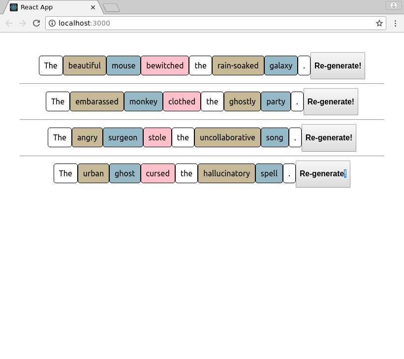

# Challenge: "Sentence Generator" (React)

## Challenge Overview

Make a React app which presents a different randomly generated sentence each time it is loaded.

### Try a live demo:

[Try this live demo!](https://cyf-sengen-simple.netlify.com/)

Make sure you understand what's happening at a conceptual level.  Each word-slot in the sentence template is picking a word randomly from an appropriate list.  E.g. from a list of nouns.

### Example Screenshot

I have added a "regenerate" button, but alternatively, the user can simply reload the page for that.

## What you need to know before starting:

This challenge is suitable if you have successfully completed the homework of CYF React Week 1.

You _will_ need to know...

- how to create a React app
- how to create a component in React
- how to pass props

It will be helpful to know:

- how to populate components from an array

You DO NOT need to know about:

- state
- fetching JSON from an API
- promises

# Task: ...

# Try to finish the rest by yourself

If you want a harder challenge, don't read the rest of this document but instead try to build the app by yourself.

If you want hints, then you will find some below.

# Suggested approach

Here's one approach you might take to building this app.

## Task: Create a new React app

Create a new empty React app for this challenge.

The tool can take a while to run, so continue with the next task while it's running...

## Task: Design your layout _on paper_

Design your layout on paper. Keep it very simple - this is a React challenge, not a CSS challenge.

Use a layout that will be ok on a phone (but _don't_ spend time on responsive design).

Keep this drawing around for reference later.

## Task: Convert your layout to JSX (HTML)

Convert the drawing to HTML (on codepen or elsewhere) and check the buttons appear correctly.
_DON'T_ add any CSS or extra markup to make it look good just now. That will only make it more difficult for you to think about your app during development.

## Task: Convert your HTML to JSX within your React app

Now make a component to represent your sentence. It should generate the HTML. You can do this all first within your `App.js`, or you can build a React Component.

## Task: Have words picked at random from lists

Try to write the javascript yourself to pick one word from a list of words, at random.

If you have a lot of trouble, [here is a function you can use](https://gist.github.com/nbogie/05332f6c8834f6b57a08d8ea1edd911b)

## Task: Host your app

Host your app and prove it works by viewing it on your phone!

We recommend you use Netlify. [Instructions are here](https://gist.github.com/nbogie/bf58a391fab6884f77a6adec66047181).

(You can instead use Heroku to host, or github pages, or codesandbox.io, or glitch.com...)

## End of basic challenge!

Congratulations, you've finished the basics!

- Send the URL of your hosted app to your team on Slack.
- Make sure you can access it and play with it on a smartphone!
- Celebrate!

## Advanced Challenge: make it look good

- Now is a good time to make it look good with CSS, colour, typography, images, and creativity. Maybe you could ask someone to collaborate with you on those aspects.

## Advanced Challenges

* Allow any word to be clicked, to change *only* that word.
* Allow "like" and saving of favourite sentences
* Add different template sentences

## Further resources
