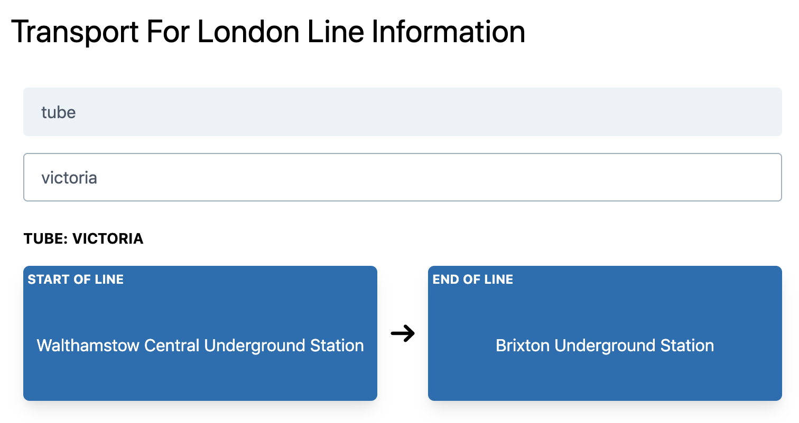
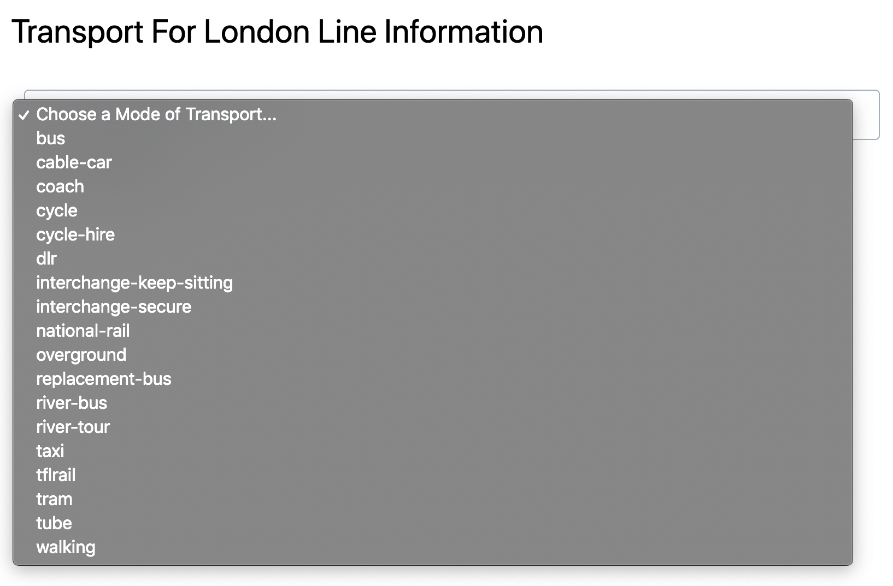
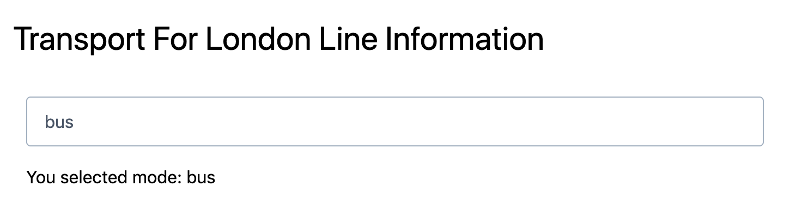
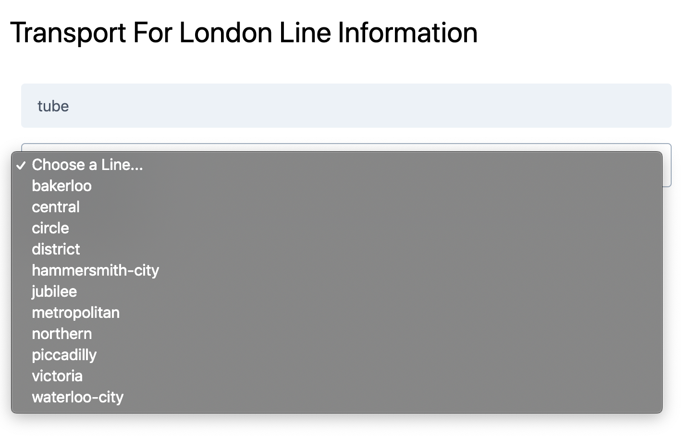
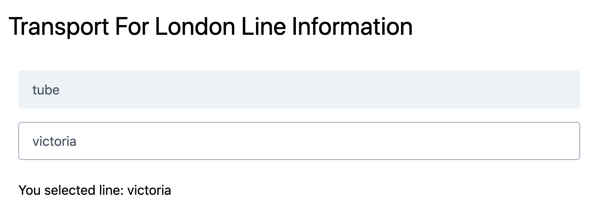
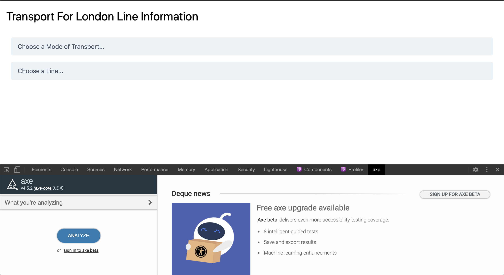
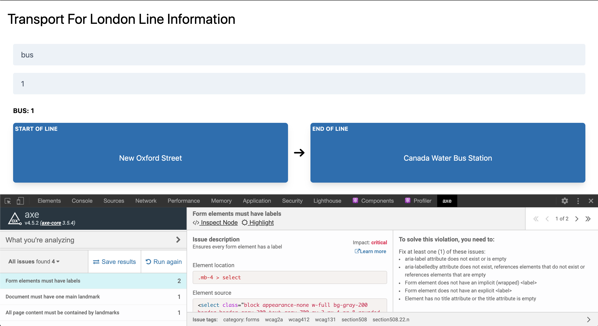

# Challenge: "Transport for London (TfL) Line Information"



## Challenge overview

Make a React app that shows Transport for London (TfL) data from their API about tubes, buses, trains, etc.

## Difficulty level

This is a more advanced challenge. Level 100 can be completed by any student has done Week 2 of the CYF React module. Level 200 can be completed by anyone who has done Week 3 of the CYF React module.

## Pre-requisites - what do I need to know to finish this challenge?

Level 100:

- `useState` Hook
- `useEffect` Hook to fetch data on load (with empty dependencies array)
- The `array.map` method and its use in React JSX

Later levels:

- `useEffect` dependencies array (the second argument)

## Getting started

**Don't** clone this repo.

Make your own React app using `create-react-app`.  See [this guide](https://docs.codeyourfuture.io/students/guides/creating-a-react-app) if you have forgotten how.

Write a plain HTML prototype (e.g. on CodePen). THEN, once you know the HTML you're attempting to create, work on the React version! This is not mandatory but it is recommended.

### Fetching data

Data for this project will need to be fetched from the TfL API. [Here is a link to their documentation](https://api.tfl.gov.uk/swagger/ui/index.html).

There will be more detail in the challenge levels below.

## GitHub & Hosting:

Add your project to GitHub and host it on Netlify.

The GitHub repo name should be exactly: `tfl-lines-react`.

The Netlify site suffix should be `-tfl-lines`, so something like...

```
cyf-YOUR_GITHUB_USERNAME-tfl-lines
```

## Level 100 challenge

Write a React app that shows a selector for the different modes of transport available from TfL (for example bus, tube, rail).

- The app should fetch data from `https://api.tfl.gov.uk/Line/Meta/Modes` **when the page loads**. The documentation for this API is available [here](https://api.tfl.gov.uk/swagger/ui/index.html?url=/swagger/docs/v1#!/Line/Line_MetaModes)

- Using this data, the app should show a `<select>` with all of the `modeName`s returned from the API

- When an option in the `<select>` is selected, it should show that `modeName` on screen

- Your project should be on GitHub and Netlify with correct names (see GitHub & Hosting section above)

### Example screenshots

Mode selector:



Selected mode:



[CLICK HERE TO SEE A VIDEO](example-screenshots/level-100-video.gif)

## Level 200 challenge

Show another selector for the different lines available for the selected mode of transport. So for example, if tube is selected, the second selector shows all of the tube lines.

- The app should fetch data from `https://api.tfl.gov.uk/Line/Mode/${SELECTED_MODE_OF_TRANSPORT}` **when a mode of transport is selected**. The documentation for this API is available [here](https://api.tfl.gov.uk/swagger/ui/index.html?url=/swagger/docs/v1#!/Line/Line_GetByMode)

- Using this data, the app should show second `<select>` with all of the line `id`s returned from the API

- When an option in this `<select>` is selected, it should show that `id` on screen

### Example screenshots

Line selector:



Selected line:



[CLICK HERE TO SEE A VIDEO](example-screenshots/level-200-video.gif)

## Level 300 challenge

Show the start and end locations for the selected line. So for example, if the Victoria line is selected, display Walthamstow Central Underground Station and Brixton Underground Station.

- The app should fetch data from `https://api.tfl.gov.uk/Line/${SELECTED_LINE}/Route` **when a line is selected**. The documentation for this API is available [here](https://api.tfl.gov.uk/swagger/ui/index.html?url=/swagger/docs/v1#!/Line/Line_LineRoutesByIds).

- Using this data, the app show the `originationName` (start of the line) and `destinationName` (end of the line) from the **first** item in the `routeSections` array.

### Example screenshots


[CLICK HERE TO SEE A VIDEO](example-screenshots/level-300-video.gif)

## Level 999 challenge

This challenge is **OPTIONAL**!

Here are some additional ideas for improving your app:

- If a mode of transport is **changed** reset the line selector and the line start/end so that they do not show out-of-date information (see video below)

- Improve the styling. Try to make it match the screenshots as closely as possible. Or, even better, try to improve the design with your own ideas

- Install the [aXe Browser Extension](https://www.deque.com/axe/axe-for-web/) in your browser.
  - This extension allows you to test for [*accessibility* problems](https://developer.mozilla.org/en-US/docs/Learn/Accessibility/What_is_accessibility) in your application. It adds a new tab inside your Dev Tools called axe. Navigate to this tab, then click Analyze
  - Try to solve any accessibility problems it tells you about. It may be useful to enable the Highlight mode so that you can see more easily which element are causing the problem. The Learn more link is also a useful resource

### Example screenshots

Resetting the line selector and line start/end:

[CLICK HERE TO SEE A VIDEO](example-screenshots/level-999-video.gif)

Running the aXe extension:



aXe extension results:



## Credits

Inspired by Ahmad Ali's original TfL exercise.
