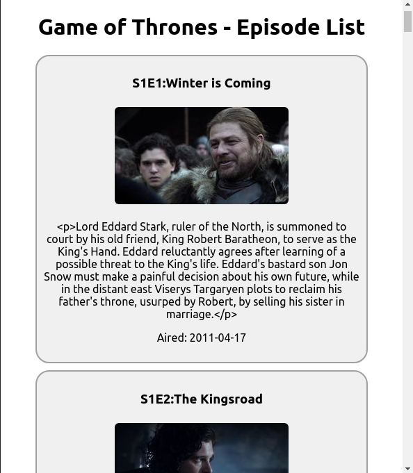
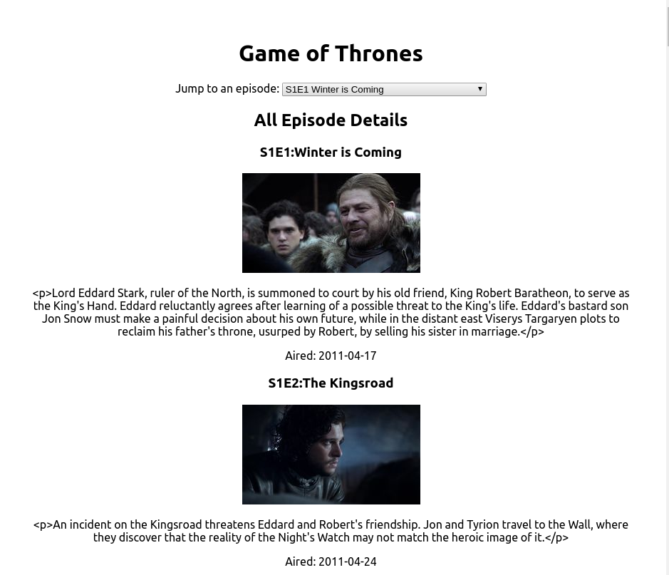
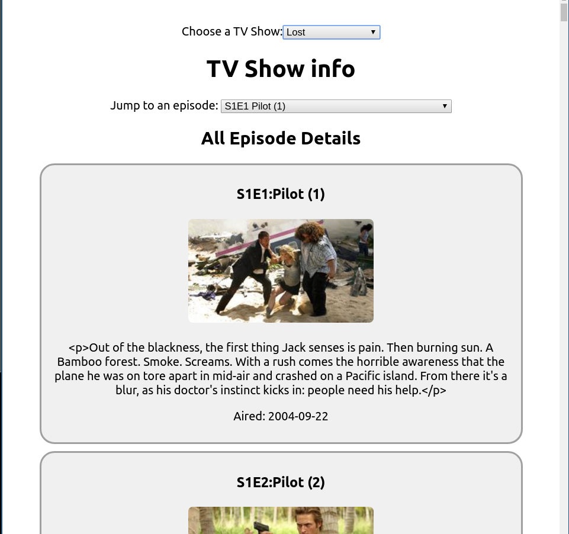
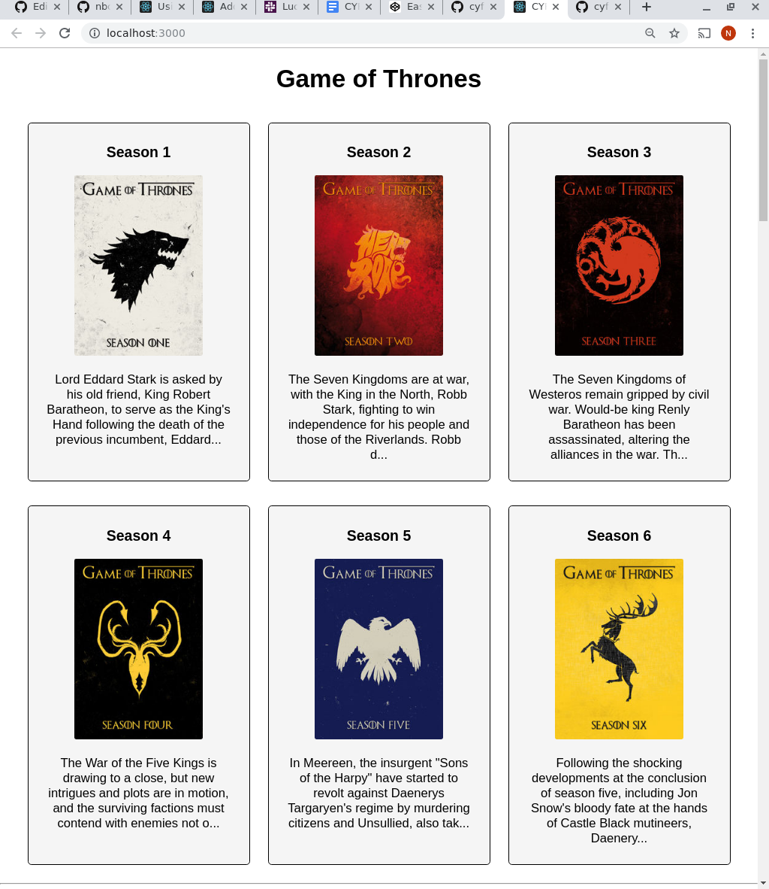

# Challenge: TV Show Episode List

Note: This is a challenge, **not** a tutorial.  It is a chance to put into practice what you've studied.

## Challenge Overview

You must make a React app which shows all of the episode summaries of a tv show such as "Game Of Thrones", in one long list.

(If you are interested in doing this challenge in vanilla JS see end of this document.)

### Example Screenshot

## What you need to know before starting:

This challenge is suitable if you have successfully completed the homework of CYF React Week 1.

You _will_ need to know...

- how to create a react app
- how to load a static json file
- how to create a component in react
- how to pass props
- how to populate components from an array

You DON'T need to know about:

- state
- fetching JSON from an API

## Task: Download and save a JSON file

Your app should read the information _locally_ from a static JSON file. Download one of the following JSON files and save it.

- [Breaking Bad](http://api.tvmaze.com/shows/169/episodes)
- [Game of Thrones](http://api.tvmaze.com/shows/82/episodes)
- [Lost](http://api.tvmaze.com/shows/123/episodes)
- [Sherlock](http://api.tvmaze.com/shows/335/episodes)
- [Star Trek TNG](http://api.tvmaze.com/shows/491/episodes)
- [The Daily Show](http://api.tvmaze.com/shows/3928/episodes)
- [The Simpsons](http://api.tvmaze.com/shows/83/episodes)
- [The Sopranos](http://api.tvmaze.com/shows/527/episodes)
- [The Walking Dead](http://api.tvmaze.com/shows/73/episodes)
- [The Wire](http://www.tvmaze.com/shows/179/the-wire)
- [The X-Files](http://api.tvmaze.com/shows/430/episodes)
- [True Blood](http://api.tvmaze.com/shows/22/episodes)

Save it in your app in a new directory `src/data/`. E.g. `src/data/sherlock.json`

# Try to figure the rest out by yourself

If you want a harder challenge, don't read the rest of this document but try to build the app by yourself.

# Suggested approach

Here's one approach you might take to building this app.

## Task: Investigate the JSON

Look at the JSON.
Ask yourself the following questions and more - these will help you when you come to use the JSON in your app:

- Does it contain an array or an object, at the top level?

  - If you think it contains an object at top level, what are the properties of the object?
  - If you think it contains an array at top level, how many elements are there in that array?

- What properties will you need from each episode?
  - What are their names?
  - Are they nested within other properties?

## Task: Create a new React app

Create a new empty React app for this challenge.

The tool can take a while to run, so continue with the next task while it's running...

## Task: Design your layout _on paper_

Design your layout on paper. Keep it very simple - this is a React challenge, not a CSS challenge.

Use a layout that will be ok on a phone (but don't do responsive design).

Keep this drawing around for reference later.

## Task: Convert your layout to HTML (really, JSX)

Make a prototype which just shows detail from one or two example episodes. _Don't_ worry about the JSON yet.

If you're still new to React, you can do this all all within your `App.js`, with no other components. 

## Split your HTML across separate React components

If you haven't already, now is a good time to "decompose" your HTML into separate sections.

Go back to your paper layout and circle and name each section that will be a separate component.

## Task: Read in the JSON

Make your app load the JSON that you previously saved in a local file. Extract the first episode and use it to populate an `Episode` component.

## Task: Make the whole list of episodes

Loop over the JSON to make a whole list of `Episode` components. 

Note: If your app crashes at this point, _DO NOT_ edit the JSON - instead, look at the error messages and fix your code to prevent those errors from happening.

## Task: Host your app

Host your app and prove it works by viewing it on your phone!

We recommend you use Netlify. [Instructions are here](https://gist.github.com/nbogie/bf58a391fab6884f77a6adec66047181).

You can instead use Heroku to host, or github pages, or codesandbox.io, or glitch.com

## End of basic challenge!

Congratulations, you've finished the basics!

- Send the URL of your hosted app to your team on Slack.
- Make sure you can access the site on a smartphone.
- Celebrate!

## Optional Challenge: store your code on github

Put your code in a github repo.  This way:
* employers can see it, 
* mentors can code-review it
* you'll have a backup!

Instructions on how to do this are [here](./github-instructions.md)

## Advanced Challenge: make an episode selector

### Example screenshot with episode selector

Modify your app to show only one episode, which your user can choose using a `select` input.

Make the selector that lists the episode numbers (E1S1) and titles, and allows you to choose one.

When you choose one from the selector, have the single shown episode update accordingly.

## Advanced Challenge: download the JSON live from the API

This requires you have learned about fetch (e.g. in React week 3).

Change your React app so that instead of using static data in a local file, it gets the data from the API just before it shows the page.

_Be careful_ when developing this. By default, every time you make a small change to your app it will be restarted and the JSON will be downloaded _again_. These frequent http requests may lead to the API banning your IP address from further requests, or throttling for some time.

## Advanced Challenge: Add the ability to choose show

### Example screenshot with show selector

Add the ability for the user to pick which _show_ is being presented. e.g. Allow them to change from "Game of Thrones" to "Star Trek", or to discover new shows!

Note: This will require use of fetch and a basic use of promises.

Make sure you have a backup of your code for your _working_ version, before you attempt this advanced version, so you always have something to show.

## Extra CSS Challenge:  Student-suggested

This is a React challenge, but if you really want more practice, how about implementing this season-selector layout, suggested by Mussie (thanks Mussie!)  There's interesting JS and React work to be done there, too!

## Vanilla JS version of this challenge

There is now [a more detailed version of this challenge in the CYF syllabus](https://github.com/CodeYourFuture/syllabus/tree/master/js-core-3/tv-show-dom-project).  That version is for vanilla JavaScript, not React. You might find it useful even if you are working in React.
